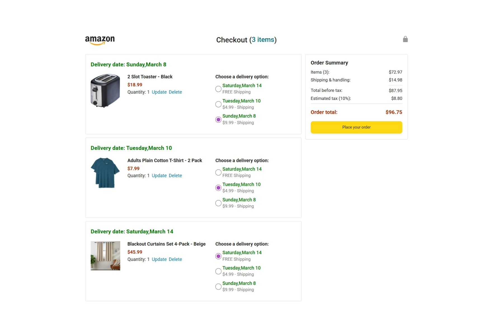
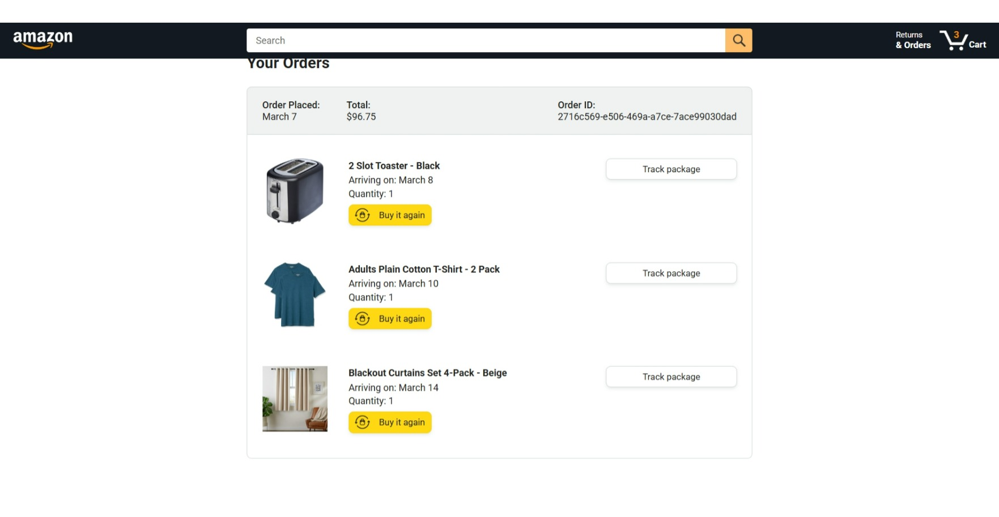
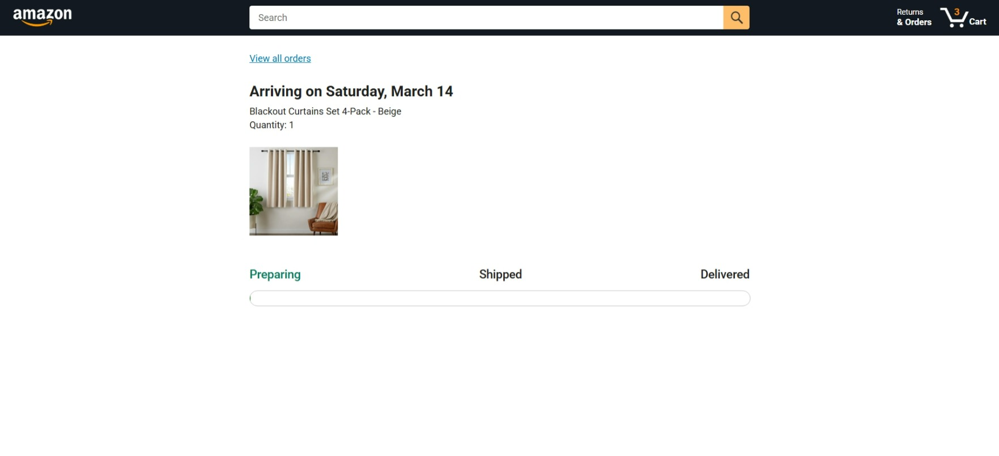

# Amazon Clone (Frontend Project)

This project is a simplified clone of Amazon built using **HTML, CSS, and JavaScript**.  
It simulates a real e-commerce workflow where users can browse products, add items to cart, place orders, and track deliveries.

---

## Features

- Browse products on the home page
- Add items to cart
- Update cart quantities
- Checkout and place orders
- View previous orders
- Track delivery status

---

## Tech Stack

- HTML
- CSS
- JavaScript (ES6 Modules)
- LocalStorage (for storing cart and orders)

---

## Project Structure
Lesson-18
│
├── backend
├── data (products, cart, orders)
├── scripts (app logic)
├── styles
├── images
├── tests
├── amazon.html
├── checkout.html
├── orders.html
└── tracking.html

---

## Screenshots

### Home Page

### Cart Page

<!-- ### Checkout Page
 -->

### Orders Page

### Tracking Page

---

## How to Run the Project

1. Clone the repository

git clone:
 https://github.com/sumit13920/javascript-amazon-project.git

 <!-- Exact  Permament Link   -->

https://github.com/sumit13920/javascript-amazon-project/tree/16409431ecdd66a2209b37c5729429fa17a6c50c/Lesson-18

2. Open the project folder

3. Open **amazon.html** in your browser

---

## Learning Purpose

This project was built to practice:

- DOM Manipulation
- Modular JavaScript
- Cart logic
- Order management
- UI rendering

---
